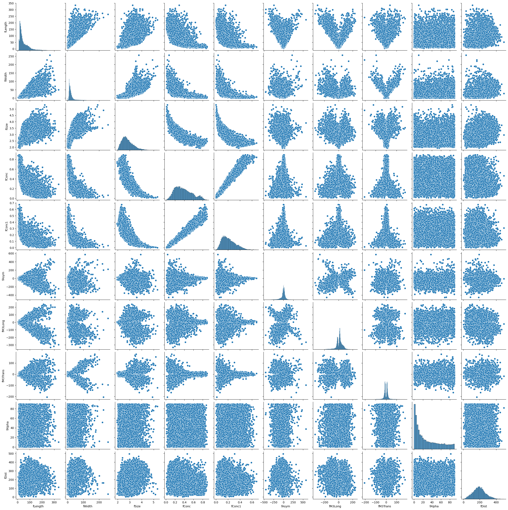
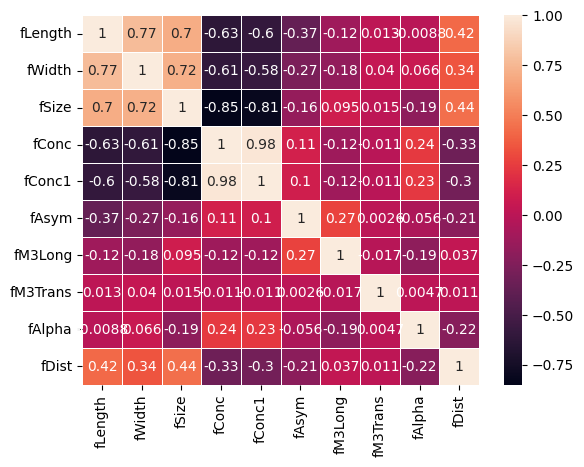

# Classificação de dados: *modelos, avaliação e desempenho*

## Machine Learning

A plataforma web de aprendizagem interativa
[freeCodeCamp](https://www.freecodecamp.org/) publicou o excelente curso
desenvolvido pela engenheira e cientista graduada pelo MIT, [Kylie
Ying](https://www.kylieying.com/), intitulado **Machine Learning for
Everybody** -- [Full
Course](https://www.youtube.com/watch?v=i_LwzRVP7bg).

## Classificação binária

No início do curso, foi abordado um problema de aprendizado
supervisionado, para classificação binária, em que o modelo aprende com
dados de treinamento devidamente rotulados, para no fim ser colocado à
prova com os dados de teste, após o ajuste com dados de validação. O
modelo deve classificar as partículas, a partir das características
fornecidas pelas *features*, em raios gama(*sinal*) ou hadron(*fundo*).

Foram utilizados diversos algoritmos de classificação, fornecidos pela biblioteca de aprendizado de máquina *scikit-learn*, em Python.

### Dataset:

Dua, D. and Graff, C. (2019). UCI Machine Learning Repository
\[<http://archive.ics.uci.edu/ml>\]. Irvine, CA: University of
California, School of Information and Computer Science.

Donated by: P. Savicky Institute of Computer Science, AS of CR Czech
Republic savicky \'@\' cs.cas.cz

O dataset *MAGIC Gamma Telescope* foi gerado com o método de simulação
denominado *Monte Carlo*, utilizado para reproduzir indiretamente as
características dos raios gama que teriam provocado as chuvas
eletromagnéticas na atmosfera. Esse método é particularmente eficaz para
modelar sistemas complexos e estocásticos, como as interações de
partículas de alta energia na atmosfera, permitindo a simulação
detalhada dos processos físicos envolvidos e a coleta de dados sobre as
características esperadas das chuvas eletromagnéticas geradas pelos
raios gama.

O artigo original que relata a simulação pode ser obtido em:
<https://inspirehep.net/literature/469835>.

## Radiação Cherenkov

Os telescópios Cherenkov são baseados no solo e os raios gama são
absorvidos pela atmosfera da Terra antes de alcançarem a superfície.
Esses telescópios detectam a radiação Cherenkov produzida quando os
raios gama interagem com a atmosfera, criando chuvas de partículas
secundárias. Esse método indireto permite estudar os raios gama de alta
energia de forma segura e eficaz.

**Radiação Cherenkov**, em homenagem físico russo e soviético, Nobel de
Física em 1958, *Pavel Alexeevitch Tcherenkov*, é a luz emitida quando
uma partícula carregada, como um elétron, viaja através de um meio (como
água ou ar) a uma velocidade superior à velocidade da luz. Este fenômeno
é análogo ao *boom* sônico produzido por um objeto que viaja mais rápido
que a velocidade do som no ar. A radiação Cherenkov é emitida em um
ângulo característico em relação à direção da partícula, formando um
cone de luz azulada, que pode ser detectado por dispositivos
especializados, como telescópios Cherenkov atmosféricos, para estudar
partículas de alta energia e suas interações.

Alguns dispositivos foram desenvolvidos para a observação direta dos
raios gama na atmosfera e além, incluindo telescópios de raios gama
espaciais, colocados em órbita acima da atmosfera terrestre, onde podem
detectar diretamente os raios gama sem interferência atmosférica.
Citamos alguns exemplos:

**Telescópio Espacial de Raios Gama Fermi**: Lançado pela NASA, este
telescópio detecta raios gama de alta energia.

**Observatório de Raios Gama Compton**: Um observatório de raios gama
que operou de 1991 a 2000.

**Balões Estratosféricos**: Equipados com detectores de raios gama,
esses balões são lançados até a estratosfera, onde a densidade
atmosférica é muito menor, permitindo a observação direta dos raios
gama. Exemplos de missões incluem:

**Observações com Balões de Alta Altitude**: Programas de balões da NASA
e outras agências espaciais que transportam detectores para altitudes
onde a interferência atmosférica é mínima.

Esses instrumentos foram projetados para operar fora da influência da
densa atmosfera terrestre, permitindo a detecção direta e o estudo dos
raios gama provenientes de fontes cósmicas.

## Processo de modelagem padrão

Em um processo de modelagem padrão, utilizamos dados de validação para
ajustar o modelo, especialmente quando estamos testando diferentes
algoritmos ou ajustando hiperparâmetros. Somente após escolher o melhor
modelo com base nos dados de validação é que utilizamos os dados de
teste para avaliar a performance final.

Um fluxo de trabalho adequado deve garantir que os dados de validação
sejam usados adequadamente para ajustar o modelo.

Ao usar os dados de validação, você pode ajustar hiperparâmetros e
selecionar o melhor modelo sem contaminar os dados de teste, que devem
ser usados apenas para a avaliação final. Se você estiver testando
múltiplos modelos, pode repetir o processo de treinamento e validação
para cada modelo, comparando seus desempenhos nos dados de validação
para decidir qual modelo será avaliado nos dados de teste.

De outra sorte, para que subdividir o dataset em *treinamento*,
*validação* e *teste*?

## Importamos as bilbiotecas

``` python
import numpy as np
import pandas as pd
import matplotlib.pyplot as plt
from sklearn.preprocessing import StandardScaler
from imblearn.over_sampling import RandomOverSampler
from sklearn.model_selection import train_test_split
from sklearn.feature_selection import SelectKBest, f_classif
from sklearn.naive_bayes import GaussianNB
```

## Carregamos o dataset

### Renomeamos as colunas

``` python
cols = ["fLength", "fWidth", "fSize", "fConc", "fConc1", "fAsym", "fM3Long", "fM3Trans", "fAlpha", "fDist", "class"]
df = pd.read_csv("magic04.data", names=cols)
df.head()
```

|   | fLength  | fWidth   | fSize  | fConc  | fConc1 | fAsym    | fM3Long  | fM3Trans | fAlpha  | fDist    | class |
|---|----------|----------|--------|--------|--------|----------|----------|----------|---------|----------|-------|
| 0 | 28.7967  | 16.0021  | 2.6449 | 0.3918 | 0.1982 | 27.7004  | 22.0110  | -8.2027  | 40.0920 | 81.8828  | g     |
| 1 | 31.6036  | 11.7235  | 2.5185 | 0.5303 | 0.3773 | 26.2722  | 23.8238  | -9.9574  | 6.3609  | 205.2610 | g     |
| 2 | 162.0520 | 136.0310 | 4.0612 | 0.0374 | 0.0187 | 116.7410 | -64.8580 | -45.2160 | 76.9600 | 256.7880 | g     |
| 3 | 23.8172  | 9.5728   | 2.3385 | 0.6147 | 0.3922 | 27.2107  | -6.4633  | -7.1513  | 10.4490 | 116.7370 | g     |
| 4 | 75.1362  | 30.9205  | 3.1611 | 0.3168 | 0.1832 | -5.5277  | 28.5525  | 21.8393  | 4.6480  | 356.4620 | g     |


## Transformamos a variável categórica em numérica

``` python
df["class"] = (df["class"] == "g").astype(int)
```

``` python
df.head()
```


|   | fLength  | fWidth   | fSize  | fConc  | fConc1 | fAsym    | fM3Long  | fM3Trans | fAlpha  | fDist    | class |
|---|----------|----------|--------|--------|--------|----------|----------|----------|---------|----------|-------|
| 0 | 28.7967  | 16.0021  | 2.6449 | 0.3918 | 0.1982 | 27.7004  | 22.0110  | -8.2027  | 40.0920 | 81.8828  | 1     |
| 1 | 31.6036  | 11.7235  | 2.5185 | 0.5303 | 0.3773 | 26.2722  | 23.8238  | -9.9574  | 6.3609  | 205.2610 | 1     |
| 2 | 162.0520 | 136.0310 | 4.0612 | 0.0374 | 0.0187 | 116.7410 | -64.8580 | -45.2160 | 76.9600 | 256.7880 | 1     |
| 3 | 23.8172  | 9.5728   | 2.3385 | 0.6147 | 0.3922 | 27.2107  | -6.4633  | -7.1513  | 10.4490 | 116.7370 | 1     |
| 4 | 75.1362  | 30.9205  | 3.1611 | 0.3168 | 0.1832 | -5.5277  | 28.5525  | 21.8393  | 4.6480  | 356.4620 | 1     |

## Visualizamos as distribuições

**Criamos uma matriz de gráficos de dispersão:**

``` python
import seaborn as sns
dados = df.iloc[:, :-1].copy()
sns.pairplot(data=dados)
```



**Calculamos a matriz de correlação:**

``` python
corr = df.drop(labels='class',axis=1).corr()
sns.heatmap(data=corr,xticklabels=corr.columns,yticklabels=corr.columns,linewidths=0.5,annot=True)
```



### Separação do dataset em treinamento, validação e teste

``` python
import warnings
warnings.filterwarnings('ignore', category=FutureWarning)

train, valid, test = np.split(df.sample(frac=1), [int(0.6*len(df)), int(0.8*len(df))])
```

### Conferimos o balanceamento dos dados

``` python
print(len(train[train["class"]==1]))
```


    7415

``` python
print(len(train[train["class"]==0]))
```


    3997

## Padronização e balanceamento dos dados

Além da padronização dos dados, utilizamos o método *RandomOverSampler*
para reamostragem dos dados desbalanceados.

``` python
    def scale_dataset(dataframe, oversample=False):
      X = dataframe[dataframe.columns[:-1]].values
      y = dataframe[dataframe.columns[-1]].values
    
      scaler = StandardScaler()
      X = scaler.fit_transform(X)
    
      if oversample:
        ros = RandomOverSampler()
        X, y = ros.fit_resample(X, y)
    
      data = np.hstack((X, np.reshape(y, (-1, 1))))
    
      return data, X, y
```


``` python
train, X_train, y_train = scale_dataset(train, oversample=True)
valid, X_valid, y_valid = scale_dataset(valid, oversample=False)
test, X_test, y_test = scale_dataset(test, oversample=False)
```

# Algoritmos de classificação

## KNN

O KNN é um algoritmo de aprendizado supervisionado que classifica uma
nova amostra com base na maioria dos \"vizinhos\" mais próximos. Neste
caso, utilizamos `k=5`, o que significa que a classificação de uma nova
amostra será baseada nas 5 amostras mais próximas no espaço dos
recursos.


``` python
from sklearn.neighbors import KNeighborsClassifier
from sklearn.metrics import classification_report
```


``` python
knn_model = KNeighborsClassifier(n_neighbors=5)
knn_model.fit(X_train, y_train)
```


``` python
y_valid_pred = knn_model.predict(X_valid)
```


``` python
print(classification_report(y_valid, y_valid_pred))
```


                  precision    recall  f1-score   support

               0       0.74      0.72      0.73      1334
               1       0.85      0.86      0.86      2470

        accuracy                           0.81      3804
       macro avg       0.80      0.79      0.79      3804
    weighted avg       0.81      0.81      0.81      3804


## Naive Bayes

O Naive Bayes é baseado no teorema de Bayes, que assume independência
entre os predictores. Este modelo é útil para problemas de classificação
binária e multiclasse.


``` python
from sklearn.naive_bayes import GaussianNB
```


``` python
nb_model = GaussianNB()
nb_model = nb_model.fit(X_train, y_train)
```


``` python
y_valid_pred = nb_model.predict(X_valid)
print(classification_report(y_valid, y_valid_pred))
```


                  precision    recall  f1-score   support

               0       0.69      0.40      0.50      1334
               1       0.74      0.91      0.81      2470

        accuracy                           0.73      3804
       macro avg       0.71      0.65      0.66      3804
    weighted avg       0.72      0.73      0.70      3804


## SVM

O SVM é um algoritmo que encontra um hiperplano que melhor separa as
classes de dados. Utilizamos o SVM para garantir uma separação máxima
entre as classes.


``` python
from sklearn.svm import SVC
```


``` python
svm_model = SVC()
svm_model = svm_model.fit(X_train, y_train)
```


``` python
y_valid_pred = svm_model.predict(X_valid)
print(classification_report(y_valid, y_valid_pred))
```


                  precision    recall  f1-score   support

               0       0.81      0.80      0.81      1334
               1       0.89      0.90      0.90      2470

        accuracy                           0.87      3804
       macro avg       0.85      0.85      0.85      3804
    weighted avg       0.87      0.87      0.87      3804


## Logistic Regression

A Regressão Logística é um modelo estatístico utilizado para problemas
de classificação binária. Ela estima a probabilidade de uma variável
dependente pertencer a uma determinada classe com base em uma ou mais
variáveis independentes.


``` python
from sklearn.linear_model import LogisticRegression
```


``` python
lg_model = LogisticRegression()
lg_model.fit(X_train, y_train)
```


``` python
y_valid_pred = lg_model.predict(X_valid)
print(classification_report(y_valid, y_valid_pred))
```


                  precision    recall  f1-score   support

               0       0.69      0.72      0.71      1334
               1       0.85      0.83      0.84      2470

        accuracy                           0.79      3804
       macro avg       0.77      0.77      0.77      3804
    weighted avg       0.79      0.79      0.79      3804


## Random Forest

O Random Forest é um conjunto de múltiplas árvores de decisão, onde cada
árvore é treinada com uma amostra diferente do dataset. Ele é conhecido
por melhorar a precisão e reduzir o overfitting ao combinar as previsões
de várias árvores.


``` python
from sklearn.ensemble import RandomForestClassifier
```


``` python
rf_model = RandomForestClassifier(n_estimators=100)
rf_model.fit(X_train, y_train)
```


``` python
y_valid_pred = rf_model.predict(X_valid)
print(classification_report(y_valid, y_valid_pred))
```


                  precision    recall  f1-score   support

               0       0.86      0.80      0.83      1334
               1       0.90      0.93      0.91      2470

        accuracy                           0.88      3804
       macro avg       0.88      0.86      0.87      3804
    weighted avg       0.88      0.88      0.88      3804


## AdaBoost

O AdaBoost é um algoritmo de ensemble que combina a performance de
múltiplos classificadores fracos para formar um classificador forte. Ele
ajusta iterativamente os pesos das instâncias para focar nos erros mais
difíceis.


``` python
from sklearn.ensemble import AdaBoostClassifier
```

``` python
ada_model = AdaBoostClassifier(n_estimators=50)
ada_model.fit(X_train, y_train)
```


``` python
y_valid_pred = ada_model.predict(X_valid)
print(classification_report(y_valid, y_valid_pred))
```

                  precision    recall  f1-score   support

               0       0.72      0.82      0.77      1334
               1       0.90      0.83      0.86      2470

        accuracy                           0.83      3804
       macro avg       0.81      0.83      0.82      3804
    weighted avg       0.84      0.83      0.83      3804

## Escolha do modelo para teste

Escolhemos o modelo que apresentou melhor desempenho durante a fase de
validação, para submeter os dados de teste.

``` python
y_test_pred = rf_model.predict(X_test)
print(classification_report(y_test, y_test_pred))
```


                  precision    recall  f1-score   support

               0       0.84      0.78      0.81      1357
               1       0.88      0.92      0.90      2447

        accuracy                           0.87      3804
       macro avg       0.86      0.85      0.86      3804
    weighted avg       0.87      0.87      0.87      3804

## Principais métricas

A seguir, explicamos os principais indicadores fornecidos pelo
*classification_report* do *sklearn*:

1.  **Precision (Precisão)**: A precisão é a proporção de verdadeiros
    positivos entre as previsões positivas feitas pelo modelo. Ou seja,
    ela mede a exatidão das previsões positivas do modelo.

$$ \text{Precisão} = \frac{\text{Verdadeiros Positivos (VP)}}{\text{Verdadeiros Positivos (VP)} + \text{Falsos Positivos (FP)}} $$

1.  **Recall (Recall/Sensibilidade)**: O recall é a proporção de
    verdadeiros positivos entre todas as amostras que realmente
    pertencem à classe positiva. Ele mede a capacidade do modelo de
    encontrar todas as instâncias positivas.

$$ \text{Recall} = \frac{\text{Verdadeiros Positivos (VP)}}{\text{Verdadeiros Positivos (VP)} + \text{Falsos Negativos (FN)}} $$

1.  **F1-score**: O F1-score é a média harmônica entre precisão e
    recall. Ele fornece uma única métrica que balanceia ambos, sendo
    útil especialmente quando há um desequilíbrio entre classes.

$$ \text{F1-score} = 2 \times \frac{\text{Precisão} \times \text{Recall}}{\text{Precisão} + \text{Recall}} $$

1.  **Support**: O suporte é o número de ocorrências reais de cada
    classe no dataset. Ele indica a quantidade de instâncias que cada
    classe possui no conjunto de dados de teste.

$$ \text{Support} = \text{Número de exemplos da classe} $$

1.  **Accuracy (Acurácia)**: A acurácia é a proporção de previsões
    corretas (tanto verdadeiros positivos quanto verdadeiros negativos)
    em relação ao total de previsões feitas. Ela fornece uma visão geral
    do desempenho do modelo.

$$ \text{Acurácia} = \frac{\text{Verdadeiros Positivos (VP)} + \text{Verdadeiros Negativos (VN)}}{\text{Total de Exemplos}} $$

​
### Indicadores do modelo Random Forest, na fase de teste

**Classe 0:**

*Precisão*: 0.84 (84% das previsões para a classe 0 estavam
corretas)<br> 
*Recall*: 0.78 (78% das instâncias reais da classe
0 foram corretamente identificadas)<br>
*F1-score*: 0.81 (média
harmônica de precisão e recall para a classe 0)<br> 
*Support*:
1357 (há 1357 instâncias reais da classe 0 no dataset de teste)

**Classe 1:**

*Precisão*: 0.88 (88% das previsões para a classe 1 estavam
corretas)<br>
*Recall*: 0.92 (92% das instâncias reais da classe
1 foram corretamente identificadas)<br>
*F1-score*: 0.90 (média
harmônica de precisão e recall para a classe 1)<br>
*Support*:
2447 (há 2499 instâncias reais da classe 1 no dataset de
teste)

**Acurácia Geral**: 0.87 (87% das previsões totais estavam corretas)

**Macro Average (média das métricas por classe):**

Precisão: 0.86<br>
Recall: 0.85<br>
F1-score: 0.86

**Weighted Average** (média ponderada das métricas, considerando o
suporte de cada classe):

*Precisão*: 0.87<br>
*Recall*: 0.87<br>
*F1-score*: 0.87

Esses indicadores mostram que o modelo **RandomForestClassifier** teve um
bom desempenho, com uma *acurácia* de 87% e valores altos de *precisão*,
*recall* e *F1-score* para ambas as classes.

<br>
<br>

**Referências:**

https://doi.org/10.48550/arXiv.2305.12888<br>

https://www.eso.org/public/teles-instr/paranal-observatory/ctao/<br>

https://www.datacamp.com/tutorial/k-nearest-neighbor-classification-scikit-learn<br>

https://www.datacamp.com/tutorial/random-forests-classifier-python


